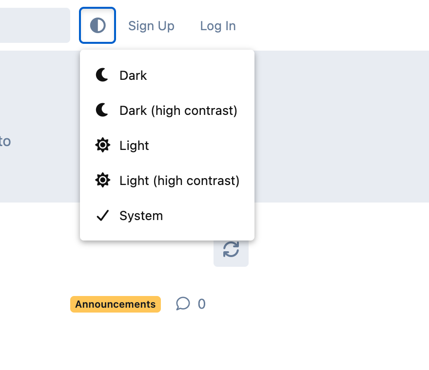
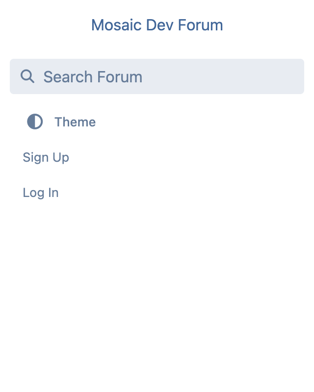

# Theme Toggle

[](https://floxum.com/extension/ernestdefoe/theme-toggle)
[](https://floxum.com/extension/ernestdefoe/theme-toggle)
[](https://floxum.com/extension/ernestdefoe/theme-toggle)
[](https://floxum.com/extension/ernestdefoe/theme-toggle)
[](https://floxum.com/extension/ernestdefoe/theme-toggle)

A small, theme-agnostic day/night/system picker for the Flarum 2 header. Drops into any Flarum 2 theme that respects the native `<html data-theme="…">` signal (every theme that ships with or extends Flarum 2 does, including the default).


## Screenshots

### Desktop — header button

A compact icon button next to Search / Sign Up / Log In. The icon reflects the active choice (☾ dark, ☀ light, ◐ system).


### Desktop — dropdown open

Five choices, each with a matching icon. The active choice is marked with a checkmark.



### Mobile — slide-out drawer

On phone-width viewports Flarum re-renders `HeaderSecondary` inside `.App-drawer`. The button switches to a labeled, full-width menu row so it lines up with Search / Sign Up / Log In.



## Features

- **Five choices.** Dark, Dark (high contrast), Light, Light (high contrast), System.
- **Native Flarum 2 signal.** The extension only flips `<html data-theme="…">` and `localStorage` — no theme-specific CSS, so it composes with any well-behaved Flarum 2 theme (default, [Aurora](https://github.com/ernestdefoe/aurora), or any third-party theme).
- **System mode honours OS preferences.** When System is active, the theme follows `prefers-color-scheme` for light/dark and `prefers-contrast: more` for the `-hc` variants — so an accessibility user with macOS / Windows "Increase contrast" turned on automatically gets the right palette.
- **Live OS updates.** Changes to the OS theme or contrast preference are picked up immediately while the tab is open, with no reload.
- **Persists per visitor.** Your choice is stored in `localStorage` under `ernestdefoe-theme-toggle.choice` and re-applied on every page load before paint, so there's no FOUC.
- **Respects the admin default.** Until a visitor explicitly picks a choice, Flarum's **Admin → Appearance → Color Scheme** setting is left untouched.
- **Mobile-aware UI.** Renders as a compact icon button in the desktop header and as a labeled `"◐ Theme"` row inside the mobile slide-out drawer (where icon-only buttons would float disconnected from the surrounding Sign Up / Log In rows).
- **Localized.** All visible strings come from `locale/en.yml` and can be overridden in your forum's locale files.
- **TypeScript end-to-end.** Sources are authored in TypeScript and type-checked against Flarum core's bundled `.d.ts` files. `npm run check-typings` runs `tsc --noEmit`.

## Compatibility

- Flarum core `^2.0`
- PHP `^8.3`
- Pairs with any theme. Tested with the default theme and the Aurora theme.

## Install

```bash
composer require ernestdefoe/theme-toggle
php flarum cache:clear
```

Then enable **Theme Toggle** from the admin panel's Extensions page.

## Development

```bash
cd js
npm install
npm run build           # production bundle (writes js/dist/forum.js)
npm run dev             # watch mode for development
npm run check-typings   # tsc --noEmit, requires `composer install` at repo root first
```

The TypeScript path mapping in `js/tsconfig.json` points at `../vendor/flarum/core/js/dist-typings/`, so `composer install` at the repo root must run before `check-typings` can resolve `flarum/*` imports.

### Project layout

```
extend.php                                Flarum extension bootstrap
composer.json                             Package manifest
locale/en.yml                             User-facing strings
less/forum.less                           Header + drawer styling
js/
  forum.ts                                Webpack entry point
  tsconfig.json                           Extends flarum-tsconfig
  src/forum/
    index.ts                              Initializer + HeaderSecondary hook
    theme.ts                              Choice/storage helpers + media listener
    components/ThemeToggle.tsx            The Dropdown component
  dist/forum.js                           Compiled bundle (committed)
screenshots/                              Images in this README
```

## How it works

Flarum 2 ships four `data-theme` values: `light`, `light-hc`, `dark`, and `dark-hc`. Themes are expected to define their dark tokens as the default and their light tokens under `[data-theme^='light']`, with a high-contrast layer under `[data-theme^='light-hc']` / `[data-theme^='dark-hc']`. Because those selectors use `^=` (prefix match), setting `data-theme="light-hc"` activates *both* the regular light palette and its HC overrides via the cascade.

This extension just sets that attribute client-side:

- On boot, `theme.ts` reads the saved choice from `localStorage` and writes the corresponding string to `<html data-theme="…">` **before** the initializer runs, so the page never paints in the wrong palette.
- The `ThemeToggle` component reads the same choice for its icon and dropdown state.
- When the user picks a new option, the choice is written to `localStorage`, `<html>` is updated, and Mithril redraws the button.
- In System mode, a `matchMedia` listener for `prefers-color-scheme` and `prefers-contrast: more` re-applies the choice live.

No theme-specific CSS, no setting payload, no server round-trip.

## Translations

Override any string by adding the matching key under `ernestdefoe-theme-toggle.forum.toggle.*` in your forum's locale file:

| Key                       | Default                  |
| ------------------------- | ------------------------ |
| `label`                   | `Theme`                  |
| `option_dark`             | `Dark`                   |
| `option_dark_hc`          | `Dark (high contrast)`   |
| `option_light`            | `Light`                  |
| `option_light_hc`         | `Light (high contrast)`  |
| `option_system`           | `System`                 |

## License

[MIT](LICENSE) © Ernest Defoe
